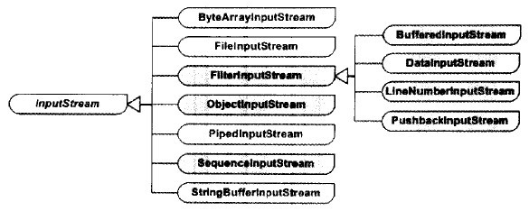
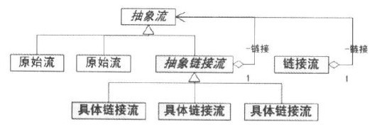
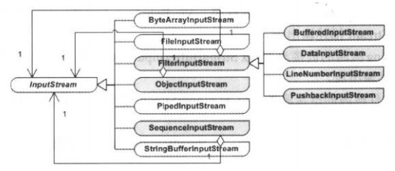
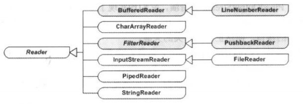
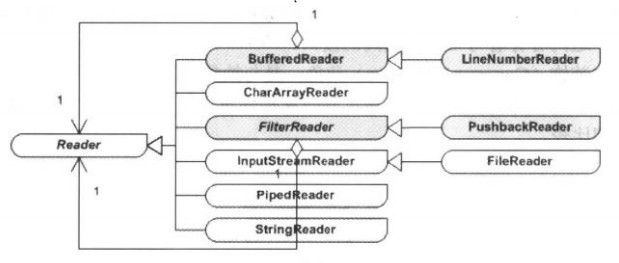
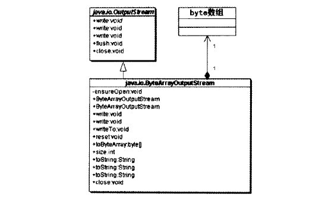

**inputStream有7个直接子类，有四个属于FilterInputStream**

**根据输入流的源的类型，可以将流分为两种，即原始流类和链接流处理器。**
原始流类处理器包括4种：
ByteArrayInputStream：为多线程的通讯提供缓冲区操作工作，接受一个Byte数组作为流的源。
FileInputStream：建立一个与文件有关的输入流。接受一个File对象作为流的源。
PipedInputStream：可以和PipedOutputStream配合使用，用于读入一个数据管道的数据。
StringBufferInputStream：将一个字符串缓冲区转换为一个输入流。

链接流处理器
FilterInputStream：BufferInputStream、DataInputStream、LineNumberInputStream、PushBackInputStream
ObjectInputStream
SequenceInputStream：可以将已有的两个输入流连接起来，形成一个输入流，从而将多个输入流排列构成一个输入流序列。

**装饰模式**

**装饰模式的各个角色**：
**抽象构件（Component）角色**：由InputStream扮演。这是一个抽象类，为各种子类型处理器提供统一的接口。
**具体构建（Concrete Component）角色**：由ByteArrayInputStream、FileInputStream、PipedInputStream以及StringBufferInputStream等原始流处理器扮演。它们实现了抽象构建角色所规定的接口，可以被链接流处理器所装饰。
**抽象装饰（Decorator）角色**：由FilterInputStream扮演。它实现了InputStream所规定的接口。
**具体装饰（Concrete Decorator）角色**：由几个类扮演，分别是DataInputStream、BufferedInputStream 以及两个不常用到的类LineNumberInputStream和PushbackInputStream。

**Reader类型中的装饰模式**
**原始流处理器包括以下4种：**
CharArrayReader：为多线程的通讯提供缓冲区操作功能
InputStreamReader：这个类有一个子类--FileReader。
PipedReader：可以与PipedOutputStream配合使用，用于读入一个数据管道的数据。
StringReader

链接流处理器包括：BufferedReader、FilterReader

**InputStream原始流处理器中的适配器模式**
